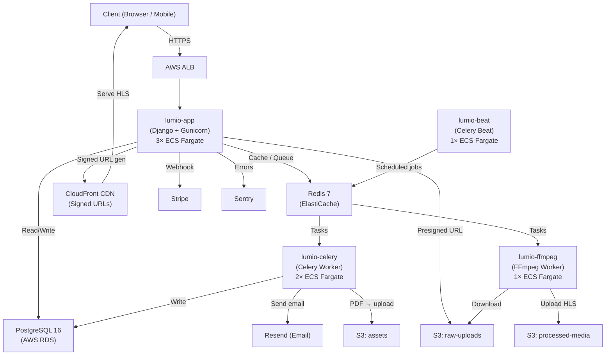
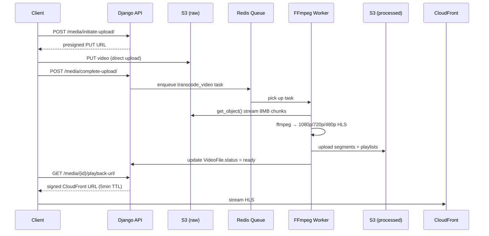
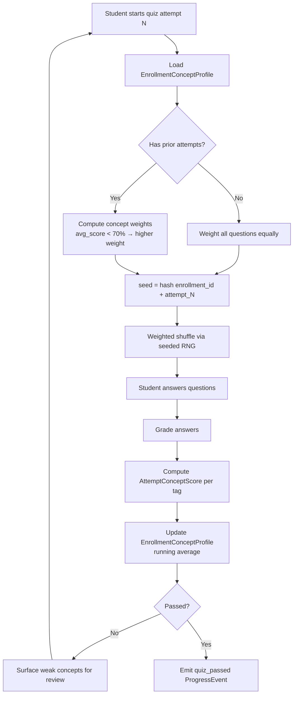
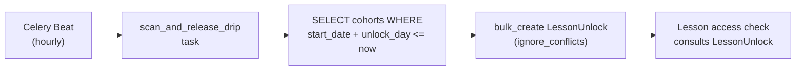
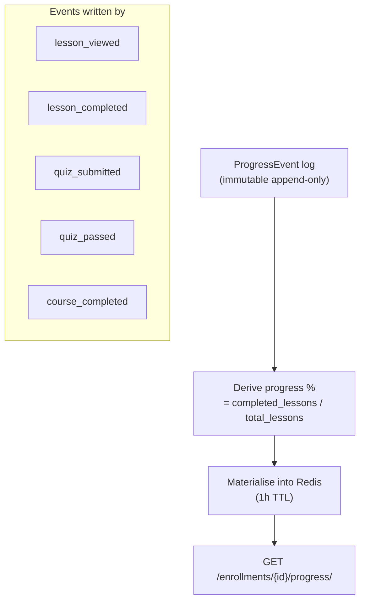

# Lumio LMS

> A production-grade Learning Management System. Instructors publish and sell video courses. Students learn, track progress, and earn verifiable certificates. The engineering focus is on the async pipeline underneath: video transcoding, event-sourced progress, adaptive quizzes, drip scheduling, and revenue sharing.

---

## Tech Stack


---

## What's Inside

| Domain | Description |
|--------|-------------|
| **Auth** | JWT + OAuth2 (Google, GitHub), password reset, email verification |
| **Courses** | Course → Section → Lesson hierarchy, draft/published states, prerequisite gating |
| **Video** | Presigned S3 upload → FFmpeg worker → HLS (1080p/720p/480p) → CloudFront signed URLs |
| **Progress** | Immutable event log (`ProgressEvent`), real-time progress derived from events |
| **Quizzes** | MC, T/F, short answer, code snippets — adaptive engine prioritises weak concepts |
| **Cohorts** | Cohort enrollment with capacity caps, drip unlock via periodic scanner |
| **Certificates** | WeasyPrint PDF → S3 → public verification URL → email delivery |
| **Emails** | Drip campaigns via Resend, re-engagement scanner, Jinja2 templates |
| **Payments** | Stripe Connect Express, platform fee split, webhook idempotency |
| **Analytics** | Enrollment trends, completion rates, drop-off by lesson, revenue breakdown |
| **Search** | PostgreSQL full-text search with GIN index on course catalog |

---

## Architecture

### System Overview



### Video Pipeline



### Adaptive Quiz Engine



### Drip Unlock (Cohort Scheduling)



### Progress: Event Sourcing



---

## Repository Layout

```
lumio/
├── apps/
│   ├── users/          # Auth, JWT, OAuth2, roles
│   ├── courses/        # Course/Section/Lesson hierarchy
│   ├── media/          # Video upload + transcoding
│   ├── enrollments/    # Enrollment, ProgressEvent (event log)
│   ├── assessments/    # Quiz engine + adaptive logic
│   ├── cohorts/        # Cohort management, drip unlock
│   ├── certificates/   # PDF generation, verification
│   ├── notifications/  # Email drip campaigns
│   ├── payments/       # Stripe Connect marketplace
│   ├── analytics/      # Instructor analytics, Redis cache
│   └── search/         # PostgreSQL FTS
├── config/
│   ├── settings/       # base / production / staging / test
│   ├── celery.py       # Celery app + beat schedule
│   └── urls.py
├── terraform/          # All AWS infra as code
├── tests/integration/  # End-to-end tests against production
├── Dockerfile          # lumio-app image
├── Dockerfile.celery   # lumio-celery image
├── Dockerfile.ffmpeg   # lumio-ffmpeg image (FFmpeg + Python)
└── docker-compose.yml  # Local development
```

---

## Local Development

**Prerequisites:** Docker, Docker Compose, Git

```bash
git clone https://github.com/StephaneWamba/lumio && cd lumio

cp .env.example .env.local
# Fill in credentials (see Environment Variables below)

docker-compose up -d

docker-compose exec django python manage.py migrate
docker-compose exec django python manage.py createsuperuser
```

| Endpoint | URL |
|----------|-----|
| API | `http://localhost:8000/api/v1/` |
| OpenAPI docs | `http://localhost:8000/api/docs/` |
| Admin | `http://localhost:8000/admin/` |
| Health | `http://localhost:8000/health/` |

---

## Tests

```bash
# Unit + integration (local)
docker-compose exec django pytest --cov=apps -v

# End-to-end (against production — requires all env vars)
python -m pytest tests/integration/ -v --no-cov -m integration
```

Code quality:

```bash
docker-compose exec django flake8 apps config
docker-compose exec django black apps config
docker-compose exec django mypy apps config --ignore-missing-imports
```

---

## Production Deployment

Infrastructure is fully managed by Terraform. Every push triggers the CI/CD pipeline automatically.

```
push → quality (lint + typecheck + tests) → build (3 Docker images → ECR) → deploy (terraform apply → ECS)
```

### First-time setup

```bash
# 1. Create Terraform state bucket
aws s3 mb s3://lumio-tf-state-$(aws sts get-caller-identity --query Account --output text) \
  --region eu-central-1

# 2. Add GitHub Secrets:
#    AWS_ACCESS_KEY_ID, AWS_SECRET_ACCESS_KEY, AWS_ACCOUNT_ID,
#    TF_STATE_BUCKET, SLACK_WEBHOOK (optional)

# 3. Push to main — pipeline does the rest
```

---

## Environment Variables

```env
DJANGO_SECRET_KEY
DJANGO_SETTINGS_MODULE=config.settings.production
DATABASE_URL
REDIS_URL
AWS_ACCESS_KEY_ID
AWS_SECRET_ACCESS_KEY
AWS_REGION
S3_RAW_BUCKET
S3_PROCESSED_BUCKET
S3_ASSETS_BUCKET
CLOUDFRONT_DOMAIN
CLOUDFRONT_KEY_PAIR_ID
CLOUDFRONT_PRIVATE_KEY        # PEM, base64-encoded
RESEND_API_KEY
STRIPE_SECRET_KEY
STRIPE_WEBHOOK_SECRET
STRIPE_PLATFORM_SHARE_PCT     # default: 20
GOOGLE_CLIENT_ID
GOOGLE_CLIENT_SECRET
GITHUB_CLIENT_ID
GITHUB_CLIENT_SECRET
SENTRY_DSN
CELERY_BROKER_URL             # same as REDIS_URL
FLOWER_BASIC_AUTH             # user:password
```

---

## Key Design Decisions

**Event-sourced progress** — `ProgressEvent` records are append-only. Progress percentage is derived from the log, never stored as a mutable counter. Handles duplicates, out-of-order events, and audits cleanly.

**Periodic drip scanner** — Cohort content unlock runs as a single hourly Celery Beat task that bulk-creates `LessonUnlock` records. One task per scan instead of one task per student — scales to 10k+ enrollments without queue flooding.

**Deterministic adaptive quiz** — Question selection is seeded with `hash(enrollment_id + attempt_number)`. Same student state always produces the same question order — reproducible, fair, auditable.

**Frontend uploads directly to S3** — Django issues a presigned PUT URL and never proxies video bytes. Eliminates multi-GB request timeouts and bandwidth bottlenecks on the API tier.

**Signed CloudFront URLs (5-min TTL)** — Students never receive a raw S3 URL. Every playback request goes through an enrollment check before a short-lived signed URL is issued.

**Separate FFmpeg container** — The FFmpeg image is ~300MB and CPU-intensive. It runs as a dedicated ECS service (`lumio-ffmpeg`) consuming only the `transcoding` queue, scaling independently from the API workers.

**PostgreSQL FTS over Elasticsearch** — A `tsvector` column with a GIN index covers full-text course search at this scale. One less infrastructure component to operate.
